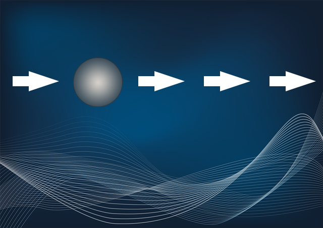

# Тестовое задание

1. Необходимо создать атлас изображений, в который должны войти файлы bg.png, sphere.png;
2. С использованием PixiJS создать анимацию бесконечного движения сферы по горизонтали, как показано на рисунке:

анимация должна быть плавной, без рывков, не должна тормозить и залипать.

Скорость движения сферы 8 пикселей за тик. Должен быть включен Motion blur. Как только сфера доходит до границы канваса и начинает заходить за границу, она должна тут же начать появляться с противоположной стороны. 

3. Результат должен быть представлен в виде ссылки на репозиторий.
